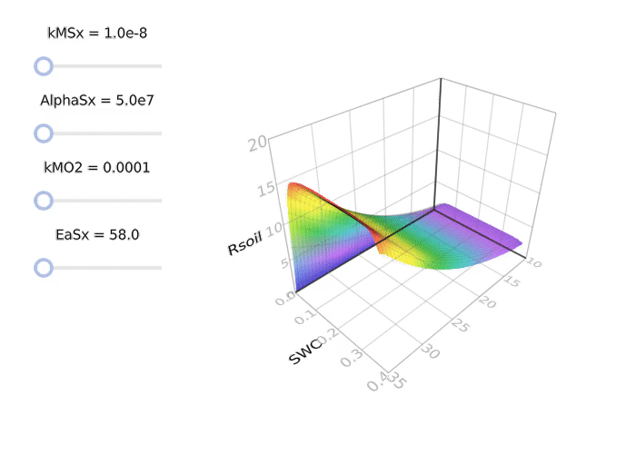

===================================
Dual Arrhenius and Michaelis-Menten
===================================
:Content: DAMM model
:Author: Dr. Alexandre A. Renchon
:Version: 1.0.0
:Homepage: https://arenchon.wordpress.com/

Interactive visualisation of DAMM 

|Animation|

